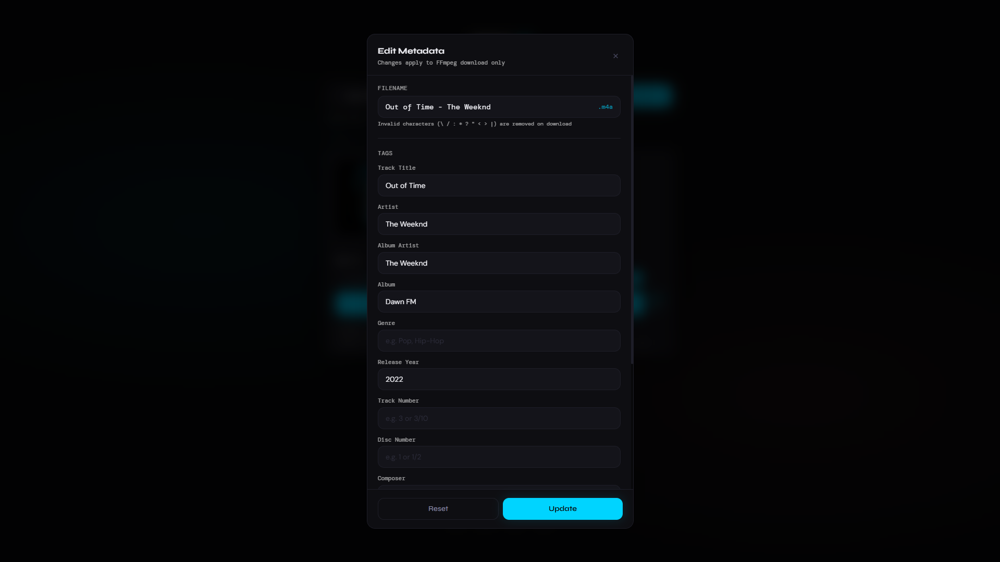

# saavn-dl

A modern JioSaavn songs & albums downloader and with ffmpeg powered metadata embedding.

Built with React, Vite and TypeScript.  
Designed with a premium glassmorphism-inspired UI.

---
## Preview

### Home

### Track


### Search


### Album search


### Album


### Download Menu


### Metadata Editor

---

## Features

- 🔗 Paste any JioSaavn song/album URL or just search by track/album name
- 🎵 Built-in audio preview player
- 🎚️ Quality selector up to 320 kbps
- 🗃️ Built-in metadata editor (per-track, works on both song and album views)
- 🎛️ Navidrome compatibility — auto-detects multi-artist albums and offers to unify Album Artist tag
- ⬇️ Download tracks & albums with embedded metadata
- ⚡ Direct download fallback if ffmpeg fails
- 📂 Library Sync — stage downloads on a fast SSD and sync to NAS on a schedule
- 🔒 VPN proxy — all CDN fetches buffered and routed server-side with retry logic, compatible with Gluetun/WireGuard

---

## Stack

- React 18
- Vite
- TypeScript
- TailwindCSS
- Framer Motion
- CryptoJS
- ffmpeg.wasm
- node-cron (server-side scheduling)

---

## Setup

```bash
# Install dependencies
npm install

# Start development server
npm run dev

# Build for production
npm run build
```

---

## Docker

Build and run using Docker:

```bash
# Build the image
docker build -t saavn-dl .

# Run the container
docker run -p 8080:80 saavn-dl
```

The app will be available at `http://localhost:8080`.

The image uses a multi-stage build (Node 20 build + Node 20 Alpine production server) and automatically sets the `Cross-Origin-Opener-Policy` and `Cross-Origin-Embedder-Policy` headers required for ffmpeg.wasm.

### Running through a VPN (Gluetun)

When self-hosted, all audio and cover art fetches are routed through the server-side proxy (`/api/proxy`). This means if you run the container behind a VPN like [Gluetun](https://github.com/qdm12/gluetun), all download traffic to JioSaavn's CDN will go through the VPN tunnel.

Example Docker Compose with Gluetun (Surfshark/WireGuard):

```yaml
services:
  gluetun:
    image: qmcgaw/gluetun:latest
    container_name: saavn-dl-gluetun
    restart: unless-stopped
    cap_add:
      - NET_ADMIN
    devices:
      - /dev/net/tun:/dev/net/tun
    volumes:
      - ${BASE_PATH}/audio/gluetun:/gluetun
    environment:
      - VPN_SERVICE_PROVIDER=surfshark
      - VPN_TYPE=wireguard
      - WIREGUARD_PRIVATE_KEY=${SURFSHARK_PRIVATE_KEY}
      - WIREGUARD_ADDRESSES=${SURFSHARK_ADDRESS}
      - SERVER_COUNTRIES=${SURFSHARK_SERVER_COUNTRIES}
    ports:
      - 4173:80

  saavn-dl:
    image: saavn-dl:local
    container_name: saavn-dl
    restart: unless-stopped
    depends_on:
      gluetun:
        condition: service_healthy
    environment:
      NODE_ENV: production
      SAAVN_LIBRARY_PATH: /app/downloads
      SAAVN_MUSIC_PATH: /music
    volumes:
      - ${MUSIC_PATH}:/music
      - ${DOWNLOADS_PATH}:/app/downloads
    network_mode: service:gluetun
    healthcheck:
      test: ["CMD", "wget", "--spider", "-q", "http://127.0.0.1:80"]
      interval: 30s
      timeout: 10s
      retries: 5
      start_period: 30s
```

With `network_mode: service:gluetun`, the saavn-dl container shares Gluetun's network stack — all outbound traffic (audio streams, cover art) goes through the VPN. The browser only talks to your server; it never connects directly to JioSaavn's CDN.

> **Note:** Search and metadata API calls (`rtmx.vercel.app`, `sda.rhythmax.workers.dev`) are still made directly by the browser since they don't expose you to JioSaavn's infrastructure. Only the actual media downloads are proxied.

---

## Save to Library

When running via Docker (or the Node server directly), you can enable a **Save to Library** option that saves downloaded album tracks directly to a folder on the server — useful for self-hosted setups where you want music saved to a NAS, media server directory, etc.

### How it works

Set the `SAAVN_LIBRARY_PATH` environment variable to the directory where you want tracks saved. When the variable is set, a third "Save to Library" button appears in the album download modal. When it's not set, the button is grayed out and disabled.

### Docker usage

```bash
# With library saving enabled — mount a host directory
docker run -p 8080:80 \
  -e SAAVN_LIBRARY_PATH=/music \
  -v /path/to/your/music:/music \
  saavn-dl
```

Tracks are saved as: `/music/<Album Name> (Year)/01 - Song Title - Artist.m4a`

### Without Docker (Node server directly)

```bash
npm run build
SAAVN_LIBRARY_PATH=/path/to/music PORT=8080 STATIC_DIR=./dist node server.js
```

### Development (with Vite proxy)

If you want hot reload during development while still testing the library feature:

```bash
# Terminal 1 — API server
SAAVN_LIBRARY_PATH=/tmp/my-music PORT=3001 STATIC_DIR=./dist node server.js

# Terminal 2 — Vite dev server (proxies /api → port 3001)
npm run dev
```

### Environment variables

| Variable | Required | Default | Description |
|----------|----------|---------|-------------|
| `SAAVN_LIBRARY_PATH` | No | _(empty)_ | Directory to save tracks (fast SSD staging). Empty = feature disabled. |
| `SAAVN_MUSIC_PATH` | No | _(empty)_ | Permanent storage directory (NAS). Empty = Library Sync disabled. |
| `PORT` | No | `80` | Port the server listens on. |
| `STATIC_DIR` | No | `./dist` | Path to the built frontend files. |

---

## Library Sync (SSD → NAS)

When both `SAAVN_LIBRARY_PATH` and `SAAVN_MUSIC_PATH` are set, a **Library** tab appears in the footer. This provides:

- **File browser** — view all staged albums/tracks in the library folder, expand folders to see individual files
- **Sync Now** — manually trigger a move of all pending files to the NAS, preserving folder structure
- **Scheduled sync** — configure automatic sync on a cron schedule (presets: every hour, 6h, 12h, daily at 3 AM, or custom)
- **Retry logic** — failed file moves are retried up to a configurable limit; after exceeding the limit, files are marked "needs attention"
- **Sync history** — view results of the last 20 sync runs

### How it works

Files are **moved** (not copied) from `SAAVN_LIBRARY_PATH` to `SAAVN_MUSIC_PATH`, mirroring the folder structure. For cross-device mounts (SSD → NAS), it falls back to copy + delete. Empty source directories are cleaned up after sync.

### Docker usage with Library Sync

```bash
docker run -p 8080:80 \
  -e SAAVN_LIBRARY_PATH=/ssd \
  -e SAAVN_MUSIC_PATH=/nas \
  -v /mnt/fast-ssd:/ssd \
  -v /mnt/nas-share:/nas \
  saavn-dl
```

### Without Docker

```bash
npm run build
SAAVN_LIBRARY_PATH=/mnt/ssd SAAVN_MUSIC_PATH=/mnt/nas PORT=8080 STATIC_DIR=./dist node server.js
```

### API Endpoints

| Method | Path | Description |
|--------|------|-------------|
| `GET` | `/api/proxy?url=<encoded-url>` | Proxy external fetches through the server (VPN) |
| `GET` | `/api/library/browse?path=` | List directory contents |
| `POST` | `/api/library/sync` | Trigger immediate sync |
| `GET` | `/api/library/sync/status` | Sync status + scheduler state |
| `GET` | `/api/library/sync/config` | Current config (schedule, retry limit) |
| `POST` | `/api/library/sync/config` | Update config |
| `POST` | `/api/library/sync/reset-retries` | Reset retry count for failed files |

---

## Download Modes

| Mode | Description |
|------|-------------|
| ⚡ Fast | Direct download without metadata embedding |
| ✨ Enhanced | Downloads audio and embeds metadata using ffmpeg.wasm |
| 💿 Individual Files (Album) | Downloads all tracks as individual files |
| 📁 Zip File (Album) | Downloads all track and stores them in a zip archive |
| 📚 Save to Library (Album) | Saves tracks directly to a server-side folder (requires `SAAVN_LIBRARY_PATH`) |
| 🔄 Library Sync | Moves staged files from SSD to NAS (requires both `SAAVN_LIBRARY_PATH` and `SAAVN_MUSIC_PATH`) |


---

## Navidrome Compatibility

When downloading multi-artist albums (compilations, "feat." albums), music servers like [Navidrome](https://www.navidrome.org/) will split the album into separate entries if each track has a different Album Artist tag.

saavn-dl automatically detects this and prompts you before downloading:

- If the album has tracks by different artists, a prompt appears asking if you want to set a unified **Album Artist** tag
- The suggested value is the album's primary artist (or "Various Artists" for compilations)
- You can edit the value or skip the fix entirely
- When applied, every track in the batch gets the same `album_artist` metadata, keeping the album grouped as one entry in Navidrome

This works across all album download modes (Individual Files, ZIP, Save to Library).

---

## Disclaimer

This project is intended for educational and personal use only.

All music content, trademarks, album arts and related assets belong to their respective owners.

This project:
- does not host music
- does not store copyrighted content
- does not distribute media files

Users are responsible for complying with their local copyright laws.

---

## License

This project is licensed under the Mozilla Public License 2.0 (MPL-2.0).

---

## Author

Made with ❤️ by OD Skyler

---

<p align="center">
  <a href="https://fmhy.net/audio#audio-ripping-sites">
    
  </a>
</p>

---