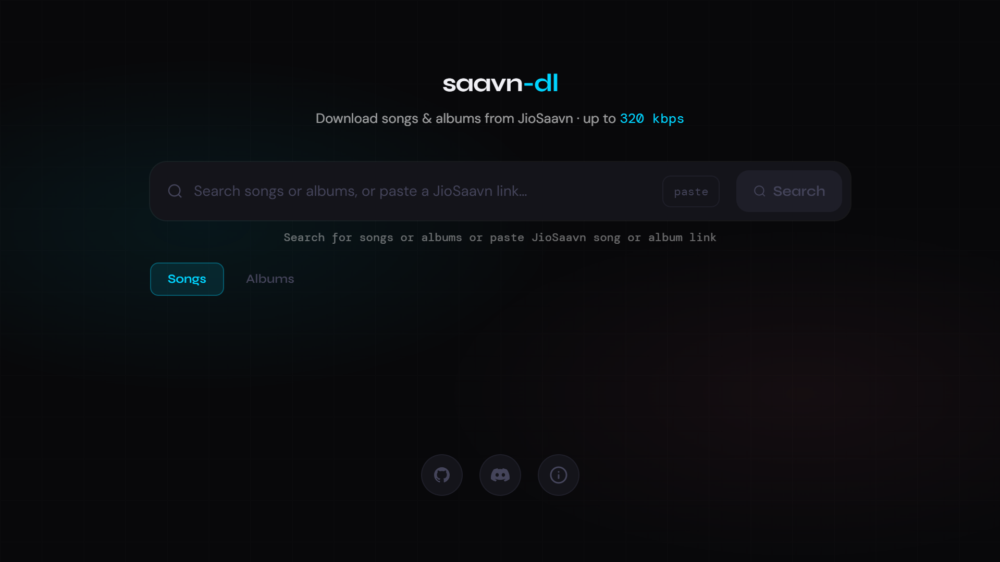
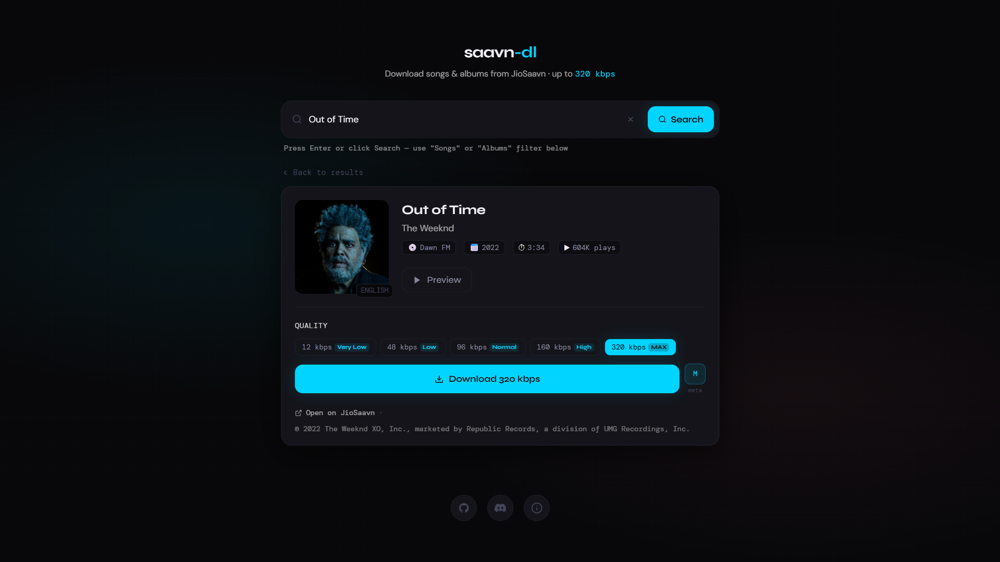
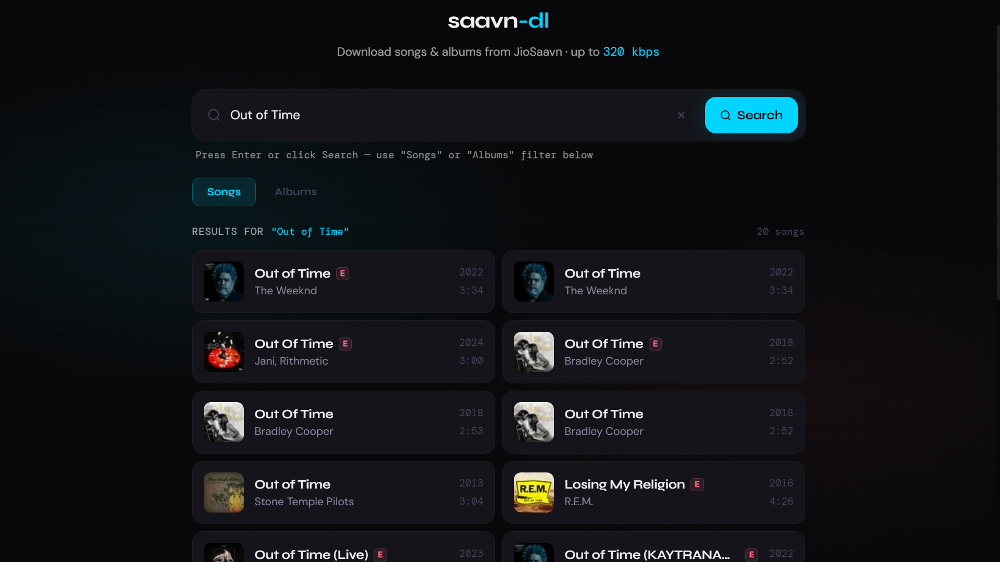
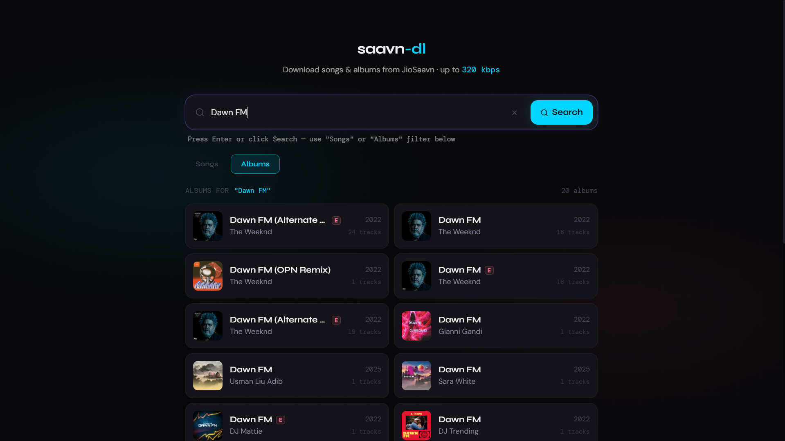
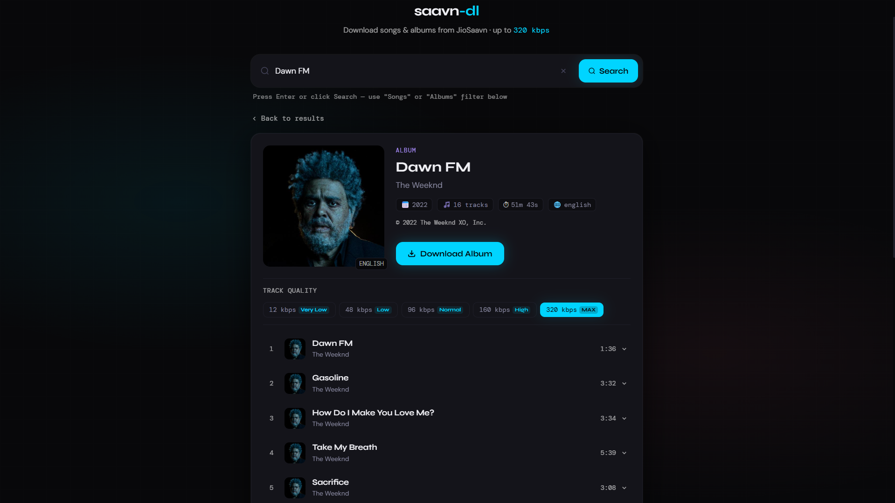
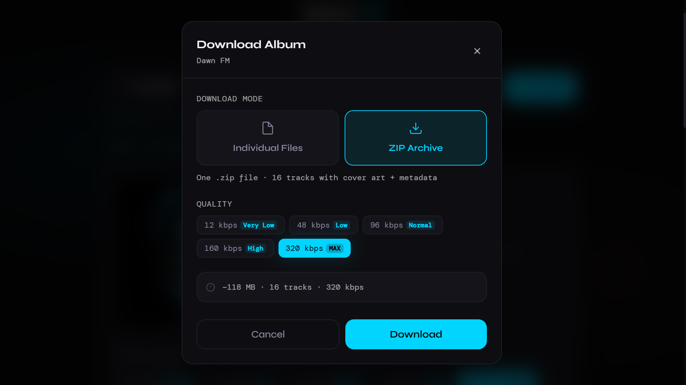

# saavn-dl

A modern JioSaavn songs & albumsdownloader and with ffmpeg powered metadata embedding.

Built with React, Vite and TypeScript.  
Designed with a premium glassmorphism-inspired UI.

---
## Preview

### Home


### Track



### Search


### Album search


### Album


### Download Menu

---

## Features

- 🔗 Paste any JioSaavn song/album URL or just search by track/album name
- 🎵 Built-in audio preview player
- 🔍 Songs & albums search support
- 📢 Built-in updates modal
- 🎚️ Quality selector upto 320 kbps
- ⬇️ Download tracks & albums with embedded metadata:
- ⚡ Direct download fallback if ffmpeg fails
- 🌑 Dark glassmorphism UI
- 📱 Responsive layout
- ✨ Smooth animations via Framer Motion

---

## Stack

- React 18
- Vite
- TypeScript
- TailwindCSS
- Framer Motion
- CryptoJS
- ffmpeg.wasm

---

## Setup

```bash
# Install dependencies
npm install

# Start development server
npm run dev

# Build for production
npm run build
```

---

## ffmpeg.wasm Requirements

`ffmpeg.wasm` requires `SharedArrayBuffer`, which means these headers must be enabled:

```txt
Cross-Origin-Opener-Policy: same-origin
Cross-Origin-Embedder-Policy: require-corp
```

Vite dev server already sets these automatically.

For production deployments (Cloudflare Pages, Vercel, Nginx, etc.), configure them manually.

---

## Cloudflare Pages (`public/_headers`)

```txt
/*
  Cross-Origin-Opener-Policy: same-origin
  Cross-Origin-Embedder-Policy: require-corp
```

---

## Vercel (`vercel.json`)

```json
{
  "headers": [
    {
      "source": "/(.*)",
      "headers": [
        {
          "key": "Cross-Origin-Opener-Policy",
          "value": "same-origin"
        },
        {
          "key": "Cross-Origin-Embedder-Policy",
          "value": "require-corp"
        }
      ]
    }
  ]
}
```

---

## Decryption

`src/utils/decrypt.ts`

Uses:
- DES
- ECB mode
- PKCS7 padding

via CryptoJS using key:

```txt
38346591
```

The decrypted media URL is dynamically modified depending on selected quality.

---

## Download Modes

| Mode | Description |
|------|-------------|
| ⚡ Fast | Direct download without metadata embedding |
| ✨ Enhanced | Downloads audio and embeds metadata using ffmpeg.wasm |

---

## Search API

Search requests are powered by OD Skyler JioSaavn API

```txt
https://js-odskyler.vercel.app/api/songs?q={query}
https://js-odskyler.vercel.app/api/albums?q={query}
```
---

## Image Proxy

Because `ffmpeg.wasm` requires COEP/COOP isolation, external images from JioSaavn CDN cannot be loaded directly in the browser.

The app uses js-odskyler.vercel.app image proxy endpoint:

```txt
/api/image?url=
```
---

## Disclaimer

This project is intended for educational and personal use only.

All music content, trademarks, album arts and related assets belong to their respective owners.

This project:
- does not host music
- does not store copyrighted content
- does not distribute media files

Users are responsible for complying with their local copyright laws.

---

## License

This project is licensed under the Mozilla Public License 2.0 (MPL-2.0).

---

## Author

Made with ❤️ by OD Skyler